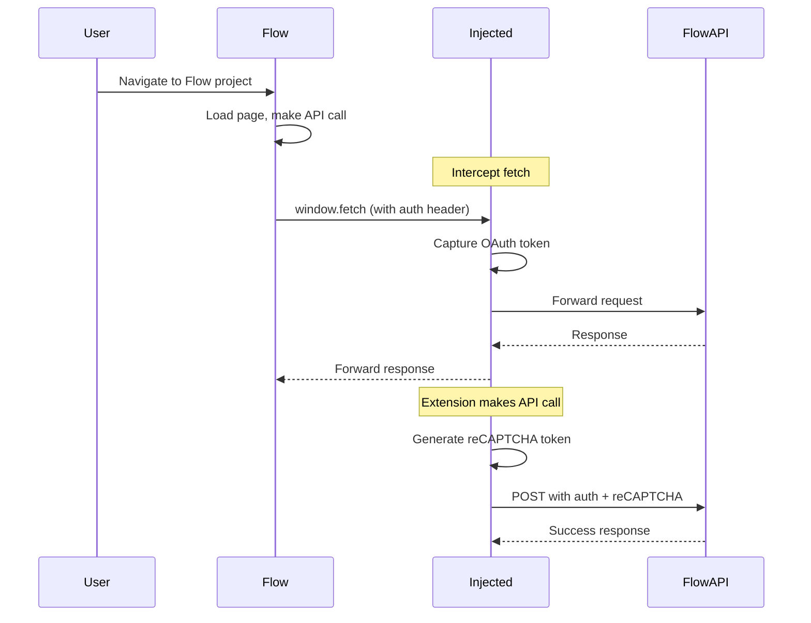

# Authentication Flow

## Overview

The Flowcio extension uses Flow's existing authentication without requiring separate login. This document explains how the extension captures and uses authentication tokens to make API calls.

## Authentication Components

The extension relies on three authentication mechanisms:

1. **OAuth Bearer Token** - User's Google account authorization
2. **reCAPTCHA Token** - Bot prevention and request validation
3. **Session ID** - Flow session tracking

## Flow Context

All authentication data is stored in the `flowContext` object in the injected script:

```typescript
interface FlowContext {
  sessionId: string | null       // Session identifier
  projectId: string | null       // Current project ID
  authToken: string | null       // OAuth bearer token
  recaptchaToken: string | null  // Latest reCAPTCHA token
  lastRecaptchaTime: number | null  // Token generation timestamp
  initialized: boolean           // Context ready flag
}
```

---

## 1. OAuth Bearer Token

### What is it?

Google OAuth 2.0 token that authorizes API requests to Flow backend.

**Format**:
```
Bearer ya29.a0Aa7pCA901Ac_dNBFavoZ4ZkJ28KowROZoqeQQ...
```

### How it's Captured

The injected script intercepts `window.fetch` to capture authorization headers:

```typescript
// injected.ts
function interceptFetch() {
  const originalFetch = window.fetch

  window.fetch = async function (...args) {
    const [resource, config] = args

    // Capture authorization header
    if (config?.headers) {
      const headers = new Headers(config.headers)

      const auth = headers.get('authorization') || headers.get('Authorization')
      if (auth && auth.startsWith('Bearer ')) {
        flowContext.authToken = auth.replace('Bearer ', '')
        console.log('[Flowcio] 🔑 Auth token captured')
      }
    }

    return originalFetch.apply(this, args)
  }
}
```

### When it's Captured

The token is automatically captured when:
1. User loads a Flow project page
2. Flow makes any API call (image gen, video gen, etc.)
3. User interacts with Flow UI

**First capture**: Usually within 1-2 seconds of page load

### How it's Used

Included in Authorization header for all API calls:

```typescript
const headers: HeadersInit = {}
if (flowContext.authToken) {
  headers['Authorization'] = `Bearer ${flowContext.authToken}`
}

await fetch(url, {
  method: 'POST',
  headers,
  body: JSON.stringify(payload),
  credentials: 'include'
})
```

### Token Lifecycle

- **Validity**: Usually 1 hour
- **Refresh**: Automatically refreshed by Google/Flow
- **Extension behavior**: Re-captures on refresh
- **Storage**: In-memory only (not persisted)

---

## 2. reCAPTCHA Enterprise Token

### What is it?

Google reCAPTCHA Enterprise v3 token for bot detection and abuse prevention.

**Site Key** (hardcoded in extension):
```typescript
const FLOW_RECAPTCHA_SITE_KEY = '6LdsFiUsAAAAAIjVDZcuLhaHiDn5nnHVXVRQGeMV'
```

### Critical Properties

**IMPORTANT**: reCAPTCHA tokens are **SINGLE-USE only**, not time-based!

- ✅ Each API call requires a fresh token
- ❌ Tokens cannot be reused or cached
- ❌ Old tokens cause 403 "reCAPTCHA evaluation failed"

### How it's Generated

```typescript
async function getReCaptchaToken(action: string = 'FLOW_GENERATION'): Promise<string | null> {
  // ALWAYS generate fresh token (no caching)
  console.log('[Flowcio] 🔑 Generating new reCAPTCHA token for each request (single-use tokens)')

  // Wait for grecaptcha to be ready
  const grecaptcha = (window as any).grecaptcha
  if (!grecaptcha?.enterprise?.execute) {
    // Wait up to 5 seconds for load
    for (let i = 0; i < 10; i++) {
      await new Promise(resolve => setTimeout(resolve, 500))
      if ((window as any).grecaptcha?.enterprise?.execute) {
        break
      }
    }
  }

  // Generate token
  if ((window as any).grecaptcha?.enterprise?.execute) {
    try {
      const token = await (window as any).grecaptcha.enterprise.execute(
        FLOW_RECAPTCHA_SITE_KEY,
        { action: action }
      )

      flowContext.recaptchaToken = token
      flowContext.lastRecaptchaTime = Date.now()

      console.log(`[Flowcio] 🛡️ Token preview: ${token.substring(0, 50)}...`)
      return token
    } catch (error) {
      console.error('[Flowcio] ❌ Failed to generate reCAPTCHA token:', error)
    }
  }

  return null
}
```

### Generation Timing

- **Duration**: ~200-500ms per token
- **Frequency**: Once per API call
- **Fallback**: If generation fails, returns null (API call will fail)

### How it's Used

Included in request body (NOT headers):

```typescript
const payload = {
  clientContext: {
    recaptchaToken: await getReCaptchaToken(),  // ← Root level
    sessionId: flowContext.sessionId
  },
  requests: prompts.map(prompt => ({
    clientContext: {
      recaptchaToken: await getReCaptchaToken(),  // ← Request level
      sessionId: flowContext.sessionId,
      projectId: flowContext.projectId,
      tool: 'PINHOLE'
    },
    // ... other fields
  }))
}
```

**Why in body and not header?**
- Headers trigger CORS preflight (OPTIONS request)
- Flow doesn't expect reCAPTCHA in headers
- Body inclusion avoids extra round-trip

### Token Structure

```typescript
// Example token (truncated):
"0cAFcWeA5B80zOb7e1TrRjB272uWQycjb1i70TwZRDCPgmdu7OE-okinU1_pMM7..."

// Length: ~1000-1500 characters
// Format: Base64-like string
// Contains: Encrypted browser fingerprint, timing data, behavior analysis
```

### Recent Fix: Caching Removal

**Problem** (before fix):
```typescript
// OLD CODE - BROKEN
if (flowContext.recaptchaToken && flowContext.lastRecaptchaTime) {
  const tokenAge = Date.now() - flowContext.lastRecaptchaTime
  if (tokenAge < 120000) { // 2 minutes
    return flowContext.recaptchaToken  // ← REUSED TOKEN = 403 ERROR
  }
}
```

**Solution** (after fix):
```typescript
// NEW CODE - WORKING
// Always generate fresh token (no caching)
// Tokens are single-use only
const token = await grecaptcha.enterprise.execute(...)
```

See: [reCAPTCHA Troubleshooting](../troubleshooting/recaptcha-errors.md) for details.

---

## 3. Session ID

### What is it?

Unique identifier for the user's Flow session.

**Format**:
```
;1766302095275
```

### How it's Extracted

Multiple strategies to find session ID:

```typescript
function extractSessionId(): string | null {
  // Strategy 1: URL parameters
  const urlParams = new URLSearchParams(window.location.search)
  const sessionFromUrl = urlParams.get('sessionId')
  if (sessionFromUrl) return sessionFromUrl

  // Strategy 2: localStorage
  for (let i = 0; i < localStorage.length; i++) {
    const key = localStorage.key(i)
    if (key?.includes('session')) {
      const value = localStorage.getItem(key)
      if (value) {
        try {
          const parsed = JSON.parse(value)
          if (parsed.sessionId) return parsed.sessionId
        } catch {
          if (value.length > 10) return value
        }
      }
    }
  }

  // Fallback: Generate timestamp-based session ID
  return `;${Date.now()}`
}
```

### How it's Used

Included in every API request:

```typescript
const clientContext = {
  sessionId: flowContext.sessionId || `;${Date.now()}`,
  recaptchaToken: '...',
  projectId: '...'
}
```

---

## 4. Project ID

### What is it?

Unique identifier for the current Flow project.

**Format**:
```
d2ae3b88-f83c-4acf-a214-e9f1e5f35c7f
```

### How it's Extracted

Parsed from URL pathname:

```typescript
function extractProjectId(): string | null {
  const match = window.location.pathname.match(/\/project\/([a-f0-9-]+)/)
  return match ? match[1] : null
}
```

**Example URL**:
```
https://labs.google/fx/tools/flow/project/d2ae3b88-f83c-4acf-a214-e9f1e5f35c7f
                                          └─────────────┬─────────────┘
                                                   Project ID
```

### How it's Used

1. In API endpoint URLs:
```typescript
const endpoint = `/v1/projects/${flowContext.projectId}/flowMedia:batchGenerateImages`
```

2. In request body:
```typescript
{
  clientContext: {
    projectId: flowContext.projectId,
    tool: 'PINHOLE'
  }
}
```

---

## Complete Authentication Flow

### Sequence Diagram



### Step-by-Step

1. **User navigates to Flow project page**
   - URL contains project ID
   - Flow loads session from cookies/storage

2. **Extension initializes context**
   ```typescript
   flowContext.sessionId = extractSessionId()
   flowContext.projectId = extractProjectId()
   ```

3. **Extension intercepts Flow's API calls**
   - Captures OAuth bearer token from headers
   - Stores in `flowContext.authToken`

4. **User triggers extension action** (e.g., generate images)

5. **Extension generates fresh reCAPTCHA token**
   ```typescript
   const recaptchaToken = await getReCaptchaToken()
   ```

6. **Extension builds authenticated request**
   ```typescript
   {
     headers: {
       Authorization: `Bearer ${flowContext.authToken}`
     },
     body: JSON.stringify({
       clientContext: {
         recaptchaToken,
         sessionId: flowContext.sessionId,
         projectId: flowContext.projectId
       }
     })
   }
   ```

7. **API call succeeds** ✅

---

## Security Considerations

### Token Storage

**In-Memory Only**:
```typescript
// ✅ Good: Stored in memory
const flowContext = {
  authToken: null,
  recaptchaToken: null
}

// ❌ Never do this:
localStorage.setItem('authToken', token)
chrome.storage.local.set({ authToken: token })
```

### Token Exposure

**Console Logging**:
```typescript
// ✅ Safe: Redacted in logs
console.log('[Flowcio] Auth token:', '[REDACTED]')

// ❌ Unsafe: Full token exposure
console.log('[Flowcio] Token:', fullToken)
```

**API Call Logging**:
```typescript
// Only log redacted headers
headers.forEach((value, key) => {
  callDetails.headers[key] = key.toLowerCase().includes('token') || key.toLowerCase().includes('auth')
    ? '[REDACTED]'
    : value
})
```

### CORS and Cookies

**Credentials Inclusion**:
```typescript
await fetch(url, {
  credentials: 'include',  // ← IMPORTANT: Include cookies
  mode: 'cors'
})
```

This ensures Flow's session cookies are sent with the request.

---

## Debugging Authentication

### Check Context Status

```typescript
// Send testConnection command
{
  connected: true,
  url: 'https://labs.google/fx/tools/flow/project/...',
  initialized: true,
  hasAuth: true,           // ← OAuth token present
  hasRecaptcha: true,      // ← reCAPTCHA token present
  recaptchaAge: 5,        // ← Token age in seconds
  sessionId: ';1766302095275',
  projectId: 'd2ae3b88-f83c-4acf-a214-e9f1e5f35c7f'
}
```

### Common Issues

**No auth token captured**:
- Solution: Wait for Flow to make an API call, or refresh page
- Check: DevTools console for "[Flowcio] 🔑 Auth token captured"

**reCAPTCHA generation fails**:
- Solution: Wait for `grecaptcha` to load
- Check: `window.grecaptcha?.enterprise?.execute` is available

**403 reCAPTCHA errors**:
- Solution: Generate fresh token (don't cache)
- See: [reCAPTCHA Troubleshooting](../troubleshooting/recaptcha-errors.md)

---

## Best Practices

### 1. Always Check Token Availability

```typescript
if (!flowContext.authToken) {
  throw new Error('No auth token available. Please refresh Flow page.')
}

if (!recaptchaToken) {
  throw new Error('Failed to generate reCAPTCHA token.')
}
```

### 2. Generate Fresh reCAPTCHA Tokens

```typescript
// ✅ Good: Fresh token per request
const token1 = await getReCaptchaToken()
await callAPI(token1)

const token2 = await getReCaptchaToken()  // New token
await callAPI(token2)

// ❌ Bad: Reusing tokens
const token = await getReCaptchaToken()
await callAPI(token)
await callAPI(token)  // This will fail!
```

### 3. Handle Token Refresh

```typescript
// If API returns 401, auth token may have expired
if (response.status === 401) {
  console.log('[Flowcio] Auth token expired, please refresh Flow page')
  throw new Error('Authentication expired')
}
```

### 4. Validate Context Before API Calls

```typescript
function validateContext(): boolean {
  if (!flowContext.initialized) {
    console.error('[Flowcio] Context not initialized')
    return false
  }

  if (!flowContext.authToken) {
    console.error('[Flowcio] No auth token')
    return false
  }

  if (!flowContext.projectId) {
    console.error('[Flowcio] No project ID')
    return false
  }

  return true
}
```

---

## Next Steps

- [API Reference - Image Generation](../api-reference/image-generation.md)
- [Making API Calls Guide](../guides/making-api-calls.md)
- [reCAPTCHA Troubleshooting](../troubleshooting/recaptcha-errors.md)
