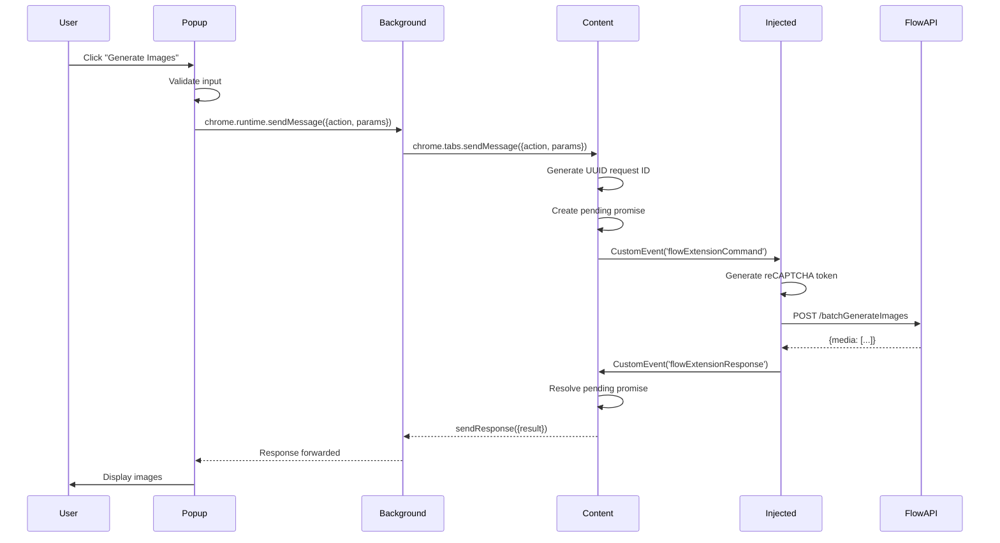

# Communication Flow

## Overview

The Flowcio extension uses a **multi-hop message passing system** to communicate across different security contexts. This document explains the detailed flow of messages from user interaction to API response.

## Message Flow Diagram



## Layer-by-Layer Communication

### 1. Popup → Background

**Protocol**: `chrome.runtime.sendMessage`

**Popup sends**:
```typescript
chrome.tabs.query({ active: true, currentWindow: true }, (tabs) => {
  chrome.tabs.sendMessage(
    tabs[0].id!,
    {
      action: 'batchGenerateImages',
      params: {
        prompts: ['a beautiful sunset'],
        aspectRatio: 'IMAGE_ASPECT_RATIO_SQUARE'
      }
    },
    (response) => {
      if (response.error) {
        console.error('Error:', response.error)
      } else {
        console.log('Result:', response.result)
      }
    }
  )
})
```

**Message Structure**:
```typescript
interface ExtensionMessage {
  action: string           // Command to execute
  params?: Record<string, any>  // Command parameters
}
```

---

### 2. Background → Content Script

**Protocol**: `chrome.tabs.sendMessage`

**Background acts as router**:
```typescript
// background.ts
chrome.runtime.onMessage.addListener((message, sender, sendResponse) => {
  console.log('[Background] Received message:', message)

  // Forward to active tab's content script
  chrome.tabs.query({ active: true, currentWindow: true }, (tabs) => {
    if (tabs[0]?.id) {
      chrome.tabs.sendMessage(tabs[0].id, message, (response) => {
        sendResponse(response)
      })
    }
  })

  return true  // Keep channel open for async response
})
```

**Why a router layer?**
- Popup cannot directly access tabs
- Background has tab management permissions
- Enables future multi-tab support

---

### 3. Content Script ↔ Injected Script

**Protocol**: Custom DOM Events

This is the most complex layer due to security sandbox boundaries.

#### Content → Injected (Request)

**Content script generates UUID and dispatches event**:
```typescript
// content.ts
const pendingMessages = new Map<string, {
  resolve: (value: any) => void
  reject: (error: Error) => void
}>()

async function sendCommandToPage(action: string, params: any): Promise<any> {
  return new Promise((resolve, reject) => {
    // Generate unique request ID
    const id = crypto.randomUUID()

    // Store pending promise
    pendingMessages.set(id, { resolve, reject })

    // Send command to page
    window.dispatchEvent(new CustomEvent('flowExtensionCommand', {
      detail: { id, action, params }
    }))

    // Timeout after 30 seconds
    setTimeout(() => {
      if (pendingMessages.has(id)) {
        pendingMessages.delete(id)
        reject(new Error(`Command timeout: ${action}`))
      }
    }, 30000)
  })
}
```

**Event detail structure**:
```typescript
interface FlowExtensionCommand {
  id: string              // UUID for request tracking
  action: string          // Command name
  params: Record<string, any>  // Command parameters
}
```

#### Injected → Content (Response)

**Injected script responds with same UUID**:
```typescript
// injected.ts
window.addEventListener('flowExtensionCommand', async (event: any) => {
  const { id, action, params } = event.detail

  try {
    // Execute command
    let result
    switch (action) {
      case 'batchGenerateImages':
        result = await batchGenerateImages(params.prompts, params.aspectRatio)
        break
      // ... other actions
    }

    // Send success response
    window.dispatchEvent(new CustomEvent('flowExtensionResponse', {
      detail: { id, result, success: true }
    }))
  } catch (error: any) {
    // Send error response
    window.dispatchEvent(new CustomEvent('flowExtensionResponse', {
      detail: { id, error: error.message, success: false }
    }))
  }
})
```

**Content script receives response**:
```typescript
// content.ts
window.addEventListener('flowExtensionResponse', (event: any) => {
  const { id, result, error, success } = event.detail

  const pending = pendingMessages.get(id)
  if (pending) {
    if (success) {
      pending.resolve(result)
    } else {
      pending.reject(new Error(error))
    }
    pendingMessages.delete(id)
  }
})
```

---

### 4. Injected Script → Flow API

**Protocol**: Standard `fetch()` with Flow's authentication

**Example API call**:
```typescript
// injected.ts
async function batchGenerateImages(
  prompts: string[],
  aspectRatio: string
): Promise<BatchGenerateImagesResponse[]> {
  // Generate fresh reCAPTCHA token
  const recaptchaToken = await getReCaptchaToken()

  // Build request payload
  const payload = {
    clientContext: {
      recaptchaToken,
      sessionId: flowContext.sessionId
    },
    requests: prompts.map(prompt => ({
      clientContext: {
        recaptchaToken,
        sessionId: flowContext.sessionId,
        projectId: flowContext.projectId,
        tool: 'PINHOLE'
      },
      seed: Math.floor(Math.random() * 1000000),
      imageModelName: 'GEM_PIX_2',
      imageAspectRatio: aspectRatio,
      prompt,
      imageInputs: []
    }))
  }

  // Make API call
  const url = `${FLOW_API_BASE}/v1/projects/${flowContext.projectId}/flowMedia:batchGenerateImages`

  const response = await fetch(url, {
    method: 'POST',
    headers: {
      'Authorization': `Bearer ${flowContext.authToken}`
    },
    body: JSON.stringify(payload),
    credentials: 'include',
    mode: 'cors'
  })

  if (!response.ok) {
    throw new Error(`API Error: ${response.status}`)
  }

  return response.json()
}
```

---

## Message Types

### Extension Messages

```typescript
// types.ts
export interface ExtensionMessage {
  action: string
  params?: any
}

export interface ExtensionResponse {
  result?: any
  error?: string
  success: boolean
}
```

### Supported Actions

| Action | Description | Parameters |
|--------|-------------|------------|
| `testConnection` | Check if extension is connected | none |
| `batchGenerateImages` | Generate multiple images | `prompts`, `aspectRatio` |
| `generateVideoText` | Generate video from text | `prompt`, `aspectRatio` |
| `generateVideoImages` | Generate video from images | `prompt`, `startImageId`, `endImageId` |
| `checkVideoStatus` | Poll video generation status | `operations` |
| `getContext` | Get current Flow context | none |
| `generateRecaptchaToken` | Generate new reCAPTCHA token | `action` |
| `debugNetworkRouting` | Debug network configuration | none |

---

## Error Handling

### Timeout Errors

```typescript
// After 30 seconds:
Error: Command timeout: batchGenerateImages
```

**Handling**:
- Content script automatically cleans up pending message
- Popup receives error callback
- User sees timeout message

### API Errors

```typescript
// From Flow API:
{
  "error": {
    "code": 403,
    "message": "reCAPTCHA evaluation failed",
    "status": "PERMISSION_DENIED"
  }
}
```

**Handling**:
```typescript
// injected.ts
if (!response.ok) {
  const errorText = await response.text()

  if (response.status === 403 && errorText.includes('reCAPTCHA')) {
    throw new Error(
      'reCAPTCHA verification failed. Please generate an image in Flow UI first.'
    )
  }

  throw new Error(`API Error: ${response.status} ${errorText}`)
}
```

### Network Errors

```typescript
// Fetch network error
Error: Failed to fetch
```

**Handling**:
- Injected script catches and reports
- Content script propagates to popup
- User sees network error message

---

## Request/Response Examples

### Example 1: Test Connection

**Request Flow**:
```typescript
// Popup
chrome.tabs.sendMessage(tabId, { action: 'testConnection' })

// → Background (forwards)
// → Content Script (dispatches event)
// → Injected Script (executes)

// Injected Script Response
{
  connected: true,
  url: 'https://labs.google/fx/tools/flow/project/abc123',
  initialized: true,
  hasAuth: true,
  hasRecaptcha: true,
  recaptchaAge: 5,
  sessionId: ';1766302095275',
  projectId: 'd2ae3b88-f83c-4acf-a214-e9f1e5f35c7f'
}
```

### Example 2: Generate Images

**Request Flow**:
```typescript
// Popup
chrome.tabs.sendMessage(tabId, {
  action: 'batchGenerateImages',
  params: {
    prompts: ['a sunset over mountains', 'a futuristic city'],
    aspectRatio: 'IMAGE_ASPECT_RATIO_LANDSCAPE'
  }
})

// → Injected Script processes
// → Generates reCAPTCHA token
// → Makes API call
// → Returns response

// Response
{
  media: [
    {
      name: 'projects/.../media/abc123',
      uri: 'https://...',
      mimeType: 'image/png'
    },
    {
      name: 'projects/.../media/def456',
      uri: 'https://...',
      mimeType: 'image/png'
    }
  ]
}
```

---

## Performance Considerations

### Message Overhead

- **Popup → Background**: ~1-5ms
- **Background → Content**: ~1-5ms
- **Content → Injected**: ~1ms (same document)
- **Total overhead**: ~3-11ms (negligible)

### API Call Time

- **reCAPTCHA generation**: ~200-500ms
- **Image generation**: ~10-30 seconds
- **Video generation**: ~30-120 seconds

### Timeout Strategy

```typescript
const TIMEOUTS = {
  messageQueue: 30000,     // 30 seconds
  imageGeneration: 60000,  // 60 seconds
  videoPolling: 600000     // 10 minutes
}
```

---

## Debugging Communication

### Content Script Logging

```typescript
// content.ts - enable verbose logging
const DEBUG = true

if (DEBUG) {
  console.log('[Content] Sending command:', { id, action, params })
  console.log('[Content] Pending messages:', pendingMessages.size)
}
```

### Injected Script Logging

```typescript
// injected.ts - comprehensive logging
console.log('[Flowcio] 🎯 Received command:', { id, action, params })
console.log('[Flowcio] 📤 Calling API:', endpoint, payload)
console.log('[Flowcio] 📥 Response:', data)
```

### Chrome DevTools

1. **Popup**: Right-click extension icon → Inspect popup
2. **Background**: chrome://extensions → Service worker "Inspect"
3. **Content Script**: Page DevTools → check console
4. **Injected Script**: Page DevTools → check console (look for [Flowcio] prefix)

---

## Best Practices

### 1. Always Handle Timeouts

```typescript
setTimeout(() => {
  if (pendingMessages.has(id)) {
    reject(new Error('Timeout'))
  }
}, 30000)
```

### 2. Clean Up Pending Messages

```typescript
// Always delete after resolve/reject
pendingMessages.delete(id)
```

### 3. Use Unique IDs

```typescript
// UUID ensures no collision
const id = crypto.randomUUID()
```

### 4. Validate Responses

```typescript
if (!response.ok) {
  throw new Error(`API Error: ${response.status}`)
}
```

### 5. Keep Channels Open

```typescript
// In background/content scripts
chrome.runtime.onMessage.addListener((msg, sender, sendResponse) => {
  // Do async work
  asyncHandler(msg).then(sendResponse)
  return true  // ← IMPORTANT: keeps channel open
})
```

---

## Next Steps

- [Authentication Flow](./authentication.md) - Deep dive into auth and reCAPTCHA
- [Making API Calls](../guides/making-api-calls.md) - Step-by-step guide
- [Troubleshooting](../troubleshooting/common-issues.md) - Common issues
